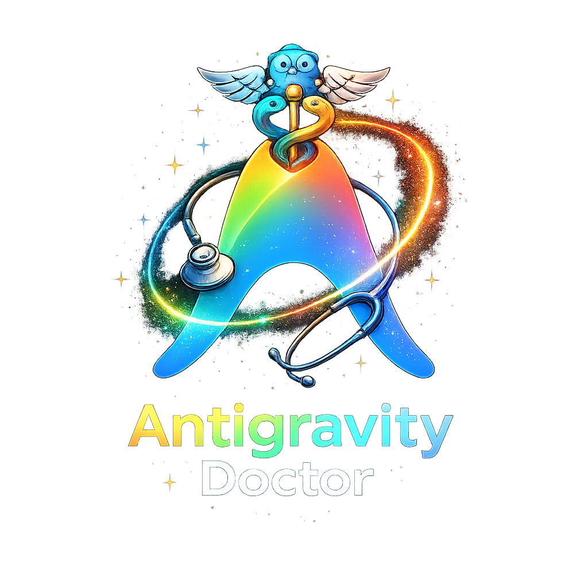

<p align="center">
  
</p>

<h1 align="center">Antigravity Doctor</h1>

<p align="center">
  <strong>Your conversations didn't disappear. They were just invisible.</strong><br>
  <em>One click to bring them all back. No reboot. No Python. No drama.</em>
</p>

<p align="center">
  <a href="../../releases/latest"></a>
  
  
  
</p>

---

## 😩 The Problem

You open Antigravity. Your conversations are **gone**. All of them. Again.

You had 77 chats. Hours of context, code reviews, debugging sessions — vanished from the sidebar like they never existed. But the files are still on your disk. Antigravity just... forgot about them.

**Sound familiar?** You're not alone. This is a known bug where Antigravity's internal index gets silently wiped.

## 💊 The Cure

**Download. Run. Done.** Your conversations reappear instantly.

```
1. Close Antigravity
2. Double-click antigravity-doctor.exe
3. Reopen Antigravity
4. Breathe.
```

<p align="center">
  <a href="../../releases/latest">
    
  </a>
</p>

## 🔬 Why Existing Fixes Don't Work

The popular [`antigravity-conversation-fix`](https://github.com/FutureisinPast/antigravity-conversation-fix) patches only `trajectorySummaries` — a **legacy** database key. But since Antigravity v1.100+, the sidebar reads from a completely different key: **`chat.ChatSessionStore.index`**.

That tool never touches it. That's why your conversations keep disappearing even after running it.

<table>
<tr>
<td width="50%">

### ❌ Other tools
```json
// chat.ChatSessionStore.index
{"version":1,"entries":{}}
// ← Still empty. Still broken.
```

</td>
<td width="50%">

### ✅ Antigravity Doctor
```json
// chat.ChatSessionStore.index
{"version":1,"entries":{
  "abc123...": {"sessionId":"abc123..."},
  "def456...": {"sessionId":"def456..."},
  // ← All 77 conversations restored
}}
```

</td>
</tr>
</table>

## ✨ What It Fixes

| Symptom | Status |
|:---|:---:|
| All conversations vanish from the sidebar | ✅ Fixed |
| Conversations reappear but in wrong order | ✅ Fixed |
| Titles show as "Conversation abc123" | ✅ Fixed |
| Workspace assignments lost | ✅ Fixed |
| Ghost metadata for deleted chats | ✅ Cleaned |
| Orphan conversations (data exists, invisible) | ✅ Restored |
| Stale `.tmp` files clogging the directory | ✅ Removed |

## 🛡️ Safety First

- **🔒 Automatic backup** — Your database is backed up before any change
- **📁 Non-destructive** — Conversation files (`.pb`) are never touched
- **🔄 Idempotent** — Safe to run 100 times, same result every time
- **🧹 Clean** — No temp files, no registry changes, no system modifications

## 🐍 Python Version

Don't want to run a binary? A standalone Python version lives in [`python/`](python/):

```bash
python python/antigravity_doctor.py
```

Requires Python 3.7+. No external packages. Same fix, just slower.

## 🔧 CLI Options

```bash
# Restore all conversations (default)
./antigravity-doctor

# Also clean ghost annotations (metadata for deleted conversations)
./antigravity-doctor --clean-ghosts
```

## 🏗️ Building from Source

```bash
# Requires Go 1.21+
git clone https://github.com/hkmodd/antigravity-doctor.git
cd antigravity-doctor
go build -ldflags="-s -w" -o antigravity-doctor .
```

Cross-compile for any platform:
```bash
GOOS=windows GOARCH=amd64 go build -ldflags="-s -w" -o antigravity-doctor.exe .
GOOS=darwin  GOARCH=arm64 go build -ldflags="-s -w" -o antigravity-doctor-mac .
GOOS=linux   GOARCH=amd64 go build -ldflags="-s -w" -o antigravity-doctor-linux .
```

## 🧠 How It Works

Antigravity stores your conversations in two separate locations:

```
~/.gemini/antigravity/conversations/*.pb    ← Your actual chat data (protobuf files)
%APPDATA%/Antigravity/.../state.vscdb       ← SQLite index (what the sidebar reads)
```

When Antigravity crashes, force-quits, or updates, the SQLite index can get silently wiped — specifically the `chat.ChatSessionStore.index` key resets to `{"entries":{}}`. Your `.pb` files are perfectly fine, but Antigravity doesn't know they exist.

**Antigravity Doctor** scans your `.pb` files, reconstructs all metadata (titles, timestamps, workspaces), and writes it back to **both** database keys the app needs.

<details>
<summary><strong>📂 Project Structure</strong></summary>

```
antigravity-doctor/
├── main.go              # Entry point, orchestration, CLI
├── metadata.go          # Title resolution, workspace inference, DB operations
├── paths.go             # Cross-platform path detection, file operations
├── protobuf.go          # Minimal protobuf varint encoding/decoding
├── hide_windows.go      # Windows-specific: hide console subprocess window
├── hide_other.go        # No-op stub for Mac/Linux
├── go.mod / go.sum      # Go module + locked dependencies
├── python/              # Standalone Python version
│   ├── antigravity_doctor.py
│   ├── run_doctor.bat
│   └── README.md
├── .github/workflows/
│   └── release.yml      # CI: auto-build binaries on tag push
├── logo.png
├── README.md
└── LICENSE (MIT)
```

</details>

---

<p align="center">
  <sub>Built by an AI that got tired of losing its own conversations. 🤖💊</sub><br>
  <sub>MIT License — free to use, share, and modify.</sub>
</p>
